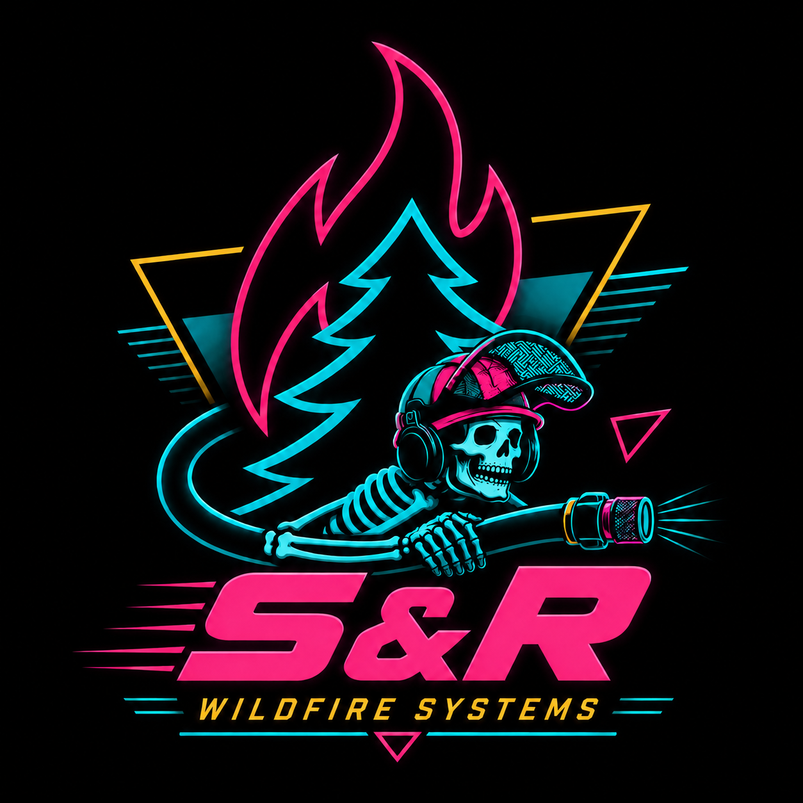
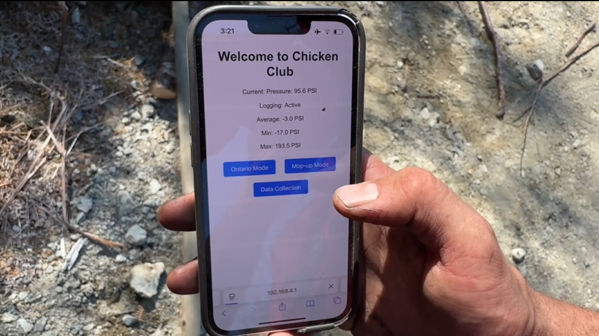
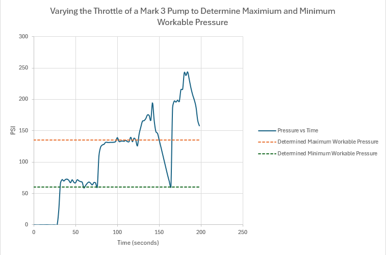

<html lang="en">
<head>
  <meta charset="UTF-8" />
  <meta name="viewport" content="width=device-width, initial-scale=1.0" />
  <title>S&R Wildfire Systems</title>
  
</head>
<body>

  <nav class="nav">
    

      

        
        S&R Wildfire Systems
      

      

        <a href="#home">Home</a>
        <a href="#about">About</a>
        <a href="#chcu">The CHCU</a>
        <a href="#meettheteam">Team</a>
        <a href="#merch">Merch</a>
      

    

  </nav>

  <header class="hero">
    

      

      

      <h1>Remote Wildfire Tech Solutions</h1>

      

  
        Long-range pressure monitoring and 3-way control
        
      

      

        <a class="btn" href="#chcu">See It in Action</a>
        
      

    

  </header>

  <main>

    <section id="about">
      <h2>Wildfire meets IoT</h2>
      

Wildland firefighting is a gritty, hard-nosed operation that demands a lot from its equipment. Much of the technology used in the field has remained simple by necessity: it needs to be reliable, durable, and able to fail in obvious ways. This keeps firefighting operations effective, but it can also leave room for major efficiency gains especially when compared to adjacent industries.
      

       

At Stanhope & Reid Wildfire Systems, we develop practical IoT-based solutions for the wildfire environment while preserving the consistency, toughness, and field reliability that firefighters demand from their equipment. Our goal is not to automate the profession, but to give firefighters better tools, better information, and more control during operations.
      

    

      

        

          <strong>1 km+ Range</strong>
          Long-distance remote control using LoRa communication.
        

        

          <strong>Remote Threeway Control</strong>
          Reduce unnecessary walking and speed up hose lay operations.
        

        

          <strong>Pressure Feedback</strong>
          Get live pressure updates from the field.
        

      

      

        <iframe
          src="https://www.youtube.com/embed/UoZGK9sne38"
          title="CHCU overview video"
          allow="accelerometer; autoplay; clipboard-write; encrypted-media; gyroscope; picture-in-picture"
          allowfullscreen>
        </iframe>
      

    </section>

    <section id="diversion">
      <h2>Water Diversion</h2>
      
The CHCU provides two types of threeway flips: full and incremental.

      <h3>Full</h3>
      

        The full threeway flip allows for complete stoppage of water flow so firefighters
        can add another length of hose.
      

      

        <iframe
          src="https://www.youtube.com/embed/O6K0zqInA_I"
          title="Full threeway flip"
          allow="accelerometer; autoplay; clipboard-write; encrypted-media; gyroscope; picture-in-picture"
          allowfullscreen>
        </iframe>
      

      <h3>Incremental</h3>
      

        As a means of managing pressure, the threeway can be opened a certain percentage
        to allow for pressure relief.
      

      

        <iframe
          src="https://www.youtube.com/embed/yZ1eOZ8rw7U"
          title="Incremental threeway flip"
          allow="accelerometer; autoplay; clipboard-write; encrypted-media; gyroscope; picture-in-picture"
          allowfullscreen>
        </iframe>
      

    </section>

    <section id="pressure">
      <h2>Pressure Readings</h2>
      

        The CHCU sends pressure readings to the user’s mobile device every 2 seconds.
        This is useful for quick mental math about how many nozzles can be open and
        for noticing when a hose may have blown a hole in it.
      

      

        
      

    </section>

    <section id="data">
      <h2>Data Capture and Analysis</h2>
      

        Pressure readings can be logged and saved as an Excel file for analysis.
        One experiment involved determining the minimum and maximum workable pressure
        for a Hansen nozzle.
      

      

        If the pressure is too high, the hose becomes too difficult to hold.
        If the pressure is too low, the duff layer cannot be properly penetrated
        and the fire cannot be extinguished.
      

      

        
      

    </section>

  </main>

  <footer>
    
&copy; 2026 S&R Wildfire Systems. All rights reserved.

  </footer>

</body>
</html>
